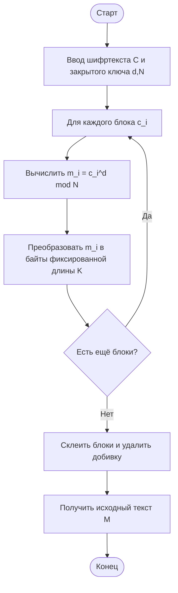

# Практическая работа №2 — RSA (Вариант 9)

В проекте реализована учебная программа на C# (ASP.NET Core Razor Pages) с графическим web-интерфейсом для:

- генерации ключей RSA;
- автоматического выбора модуля `N` на **49 десятичных знаков**;
- автоматического выбора размера блока `K` из условия `256^K < N`;
- шифрования/дешифрования текста произвольной длины;
- проверки корректности на 10 контрольных текстах;
- оценки криптостойкости и производительности.

## Блок-схема алгоритма RSA (шифрование)

```mermaid
flowchart TD
    A([Старт]) --> B[Ввод открытого текста M]
    B --> C[Задать длину N = 49 знаков]
    C --> D[Случайно выбрать простые P, Q]
    D --> E[Вычислить N = P*Q]
    E --> F{N имеет 49 знаков?}
    F -- Нет --> D
    F -- Да --> G[phi = (P-1)*(Q-1)]
    G --> H[Выбрать e: gcd(e,phi)=1]
    H --> I[Найти d = e^-1 mod phi]
    I --> J[Определить K: max K, где 256^K < N]
    J --> K[Разбить M на блоки по K байт]
    K --> L[Для каждого блока m_i вычислить c_i = m_i^e mod N]
    L --> M[Сформировать шифртекст C из c_i]
    M --> N([Конец])
```

## Блок-схема алгоритма RSA (расшифрование)



## Запуск

```bash
dotnet run --project src/RsaLab.Web
```

После запуска откройте `http://localhost:5000` или URL из консоли.

## Проверка (10 контрольных примеров)

```bash
dotnet test
```

Файлы контрольных примеров находятся в `test-data/sample01.txt ... sample10.txt`.

## Криптостойкость и производительность

- Модуль `N` длиной 49 десятичных знаков даёт примерно 163 бита безопасности по размеру модуля (очень мало для реальных задач).
- Реально безопасные RSA-ключи сегодня — от 2048 бит.
- В интерфейсе отображается фактическое время генерации ключей, шифрования и расшифрования для введённого текста.

